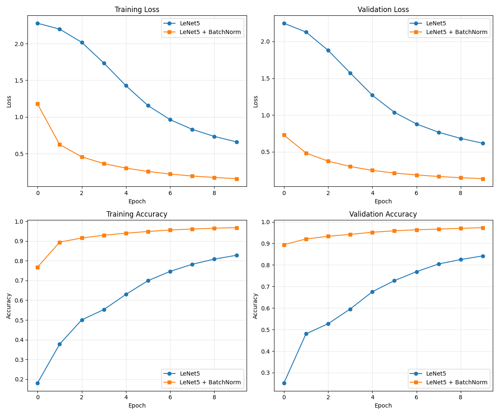

# Batch Normalization in LeNet-5

[Batch Normalization: Accelerating Deep Network Training by Reducing Internal Covariate Shift](https://arxiv.org/pdf/1502.03167) introduced the concept of batch normalization where the inputs to each layer are normalized to have a mean of zero and a variance of one. This technique has been shown to improve the training speed and performance of deep neural networks.

This repository contains an implementation of the LeNet-5 architecture with batch normalization applied after each convolutional and fully connected layer with comparison to the original LeNet-5. The implementation is done using Python and PyTorch. It uses [uv](https://docs.astral.sh/uv/) as its package manager.

Run `uv sync` to install the dependencies and `uv run main.py` to train and evaluate the model on the MNIST dataset. The code is formatted in [notebooks as scripts](https://jupytext.readthedocs.io/en/latest/formats-scripts.html) format which helps me to run and evaluate the code better in [Zed REPL](https://zed.dev/docs/repl#python).

This is the accuracy and loss curves for both models after training for 10 epochs:

